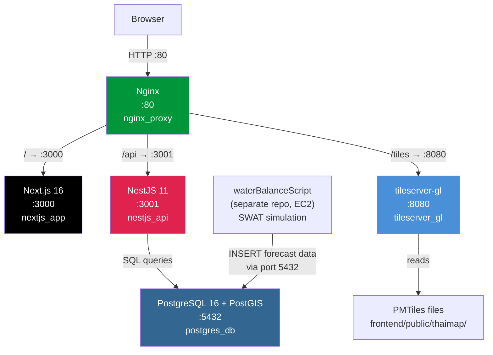
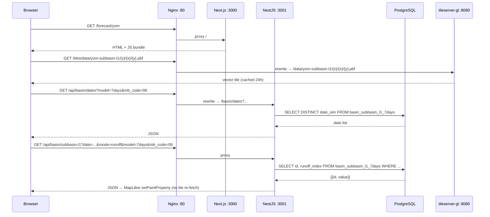
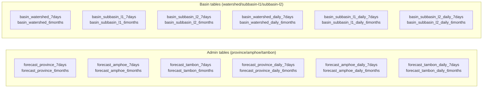
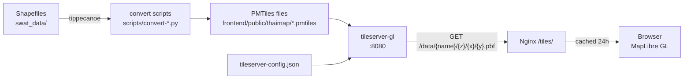

# WaterF

Thailand geospatial water forecast app. Displays SWAT hydrological model outputs on an interactive MapLibre GL map for the **Ping** and **Yom** river watersheds, in two geographic views: **basin** (watershed → subbasin-l1 → subbasin-l2) and **admin** (province → amphoe → tambon). Three forecast modes: **runoff**, **drought**, **water balance**.

---

## System Architecture



All five services run in a single Docker network (`app-network`). Only Nginx exposes a host port (80). PostgreSQL exposes 5432 for external data imports from the waterBalanceScript pipeline.

---

## Request Flow



---

## Services

| Container | Image | Internal port | Host port | Purpose |
|---|---|---|---|---|
| `nginx_proxy` | `nginx:alpine` | 80 | **80** | Reverse proxy + gzip + cache headers |
| `nextjs_app` | local build | 3000 | — | React SPA + SSR |
| `nestjs_api` | local build | 3001 | — | REST API |
| `postgres_db` | `imresamu/postgis:16-3.5-bookworm` | 5432 | **5432** | Database |
| `tileserver_gl` | `maptiler/tileserver-gl:latest` | 8080 | — | PMTiles → .pbf tiles |

### Nginx routing

| Path | Proxies to | Notes |
|---|---|---|
| `/` | `nextjs:3000` | All frontend routes |
| `/api/...` | `nestjs:3001` | Strips `/api` prefix |
| `/tiles/...` | `tileserver:8080` | Strips `/tiles` prefix; `Cache-Control: public, max-age=86400` |
| `/nginx-health` | — | 200 OK health probe |

---

## Prerequisites

| Tool | Minimum version | Notes |
|---|---|---|
| Docker Engine | 24.0+ | |
| Docker Compose | **v2 plugin** | Makefile uses `docker compose` — the legacy `docker-compose` binary will fail |
| Node.js | 20 LTS | Only needed for native dev / running tests outside Docker |
| npm | 9+ | Bundled with Node.js |
| Python | 3.9+ | Only needed to regenerate PMTiles or run import scripts manually |

Verify Compose v2 is installed: `docker compose version` (must show `Docker Compose version v2.x`).  
If you see `docker: 'compose' is not a docker command`, install the plugin: `sudo apt install docker-compose-plugin`.

---

## Quick Start

### First-time production server setup

1. Clone the repo and `cd waterF`
2. Copy the production template: `cp .env.docker .env`
3. Fill in `.env`:
   - `NGINX_SERVER_NAME` → your domain or server IP (e.g. `waterf.example.com` or `203.0.113.5`)
   - `DATABASE_PASSWORD` and `POSTGRES_PASSWORD` → same strong password
   - `NEXT_PUBLIC_TILES_BASE_URL` → `http://<domain>/tiles`
   - `NEXT_PUBLIC_API_URL` → `/api`
   - Basemap keys (see [Key variables](#key-variables) below)
4. `make up` — builds and starts all 5 services
5. `make import-all` — imports forecast CSVs (takes several minutes on first run)
6. Access at `http://<domain>`

> **Never edit `.env` directly in normal operation** — `make up` overwrites it from `.env.docker`.

### Local dev (quick start)

```bash
# First time only
make setup-local        # copy .env.local → .env

# Full Docker stack (always use this — bypassing Nginx breaks tile URLs)
make up                 # build + start all 5 services
make down               # stop all
make restart            # restart without rebuild
make hard-reset         # ⚠️  wipe volumes + full rebuild

# Import forecast data (DB must be running)
make import-all         # import all 4 CSV sets
make import-basin-7days
make import-basin-6months
make import-forecast-7days
make import-forecast-6months

# Native dev (postgres in Docker, apps run natively — no tileserver)
make db                 # start postgres only
make backend            # start NestJS (port 3001)
make frontend           # start Next.js (port 3000)
```

Access at **http://localhost** (port 80). Do **not** use `localhost:3000` — that bypasses Nginx and breaks tile URLs (`NEXT_PUBLIC_TILES_BASE_URL` must be absolute).

---

## Make Commands Reference

```
make help                 Show all available commands

# Setup
make setup-local          Copy .env.local → .env (first-time local dev)

# Docker lifecycle
make up                   Build (no-cache) + start full stack
make down                 Stop all services
make restart              Restart services without rebuild
make logs                 Follow all service logs
make hard-reset           ⚠️  Destroy volumes, rebuild, restart
make prune                Free disk: remove unused images + build cache

# Native dev
make db                   Start postgres only (Docker)
make db-stop              Stop postgres
make backend              Run NestJS natively (port 3001)
make frontend             Run Next.js natively (port 3000)
make kill-local           Kill processes on ports 3000 and 3001

# Data import (DB must be running)
make import-all           Import all 4 CSV sets
make import-basin-7days   Basin SWAT weekly data
make import-basin-6months Basin SWAT monthly data
make import-forecast-7days  Admin weekly data
make import-forecast-6months Admin monthly data
make truncate-forecast    Truncate all 6 admin forecast tables

# Database
make allow-remote-db      Allow 192.168.12.0/24 remote access to PostgreSQL

# Tests
make test                 Run frontend unit tests (Jest)
make e2e                  Run all E2E tests (Playwright)
make e2e FILE=e2e/forecast.spec.ts   Run one E2E file
```

---

## Environment Configuration

### Two env files

| File | Used by | Auto-copied to `.env` by |
|---|---|---|
| `.env.local` | native dev (`make frontend` / `make backend`) | `make frontend`, `make backend` |
| `.env.docker` | Docker (`make up`) | `make up` |

**Never edit `.env` directly** — it is overwritten on every `make up` or `make frontend`.

### Key variables

```env
# Database
DATABASE_HOST=postgres          # 'postgres' (Docker) or 'localhost' (dev)
DATABASE_PORT=5432
DATABASE_USER=postgres
DATABASE_PASSWORD=              # must match POSTGRES_PASSWORD
DATABASE_NAME=postgres
POSTGRES_USER=postgres          # used by Makefile for psql commands
POSTGRES_PASSWORD=              # must match DATABASE_PASSWORD

# API URL (baked into Next.js bundle at build time)
NEXT_PUBLIC_API_URL=/api        # '/api' (Docker) or 'http://localhost:3001' (dev)

# Tile server (must be absolute URL — MapLibre runs in a Web Worker)
NEXT_PUBLIC_TILES_BASE_URL=http://localhost/tiles   # .env.local
# NEXT_PUBLIC_TILES_BASE_URL=http://<domain>/tiles  # .env.docker

# Map basemap keys
# NEXT_PUBLIC_PROTOMAPS_KEY — basemap vector tiles (streets/labels). Empty = no basemap.
# NEXT_PUBLIC_MAPTILER_KEY  — terrain DEM for hillshading overlay. Empty = hillshading unavailable.
NEXT_PUBLIC_PROTOMAPS_KEY=
NEXT_PUBLIC_MAPTILER_KEY=

# Feature flags
NEXT_PUBLIC_ENABLE_SUBBASIN_L2=false     # show subbasin L2 drill-down
NEXT_PUBLIC_ENABLE_ADMIN_TAMBON=false    # show tambon level in admin mode
NEXT_PUBLIC_SHOW_ID=false                # show geo IDs on map for debugging

# Nginx
# Set to your domain or server IP in production (e.g. waterf.example.com or 203.0.113.5).
# Used as the nginx server_name directive. Defaults to 'localhost' for local dev.
NGINX_SERVER_NAME=localhost
```

### Adding a new `NEXT_PUBLIC_*` variable

`NEXT_PUBLIC_*` vars are baked into the JS bundle at build time. All four places must be updated:

1. **`.env.local`** — dev value
2. **`.env.docker`** — prod value
3. **`frontend/Dockerfile`** — add `ARG NEXT_PUBLIC_FOO` and `ENV NEXT_PUBLIC_FOO=$NEXT_PUBLIC_FOO`
4. **`docker-compose.yml`** — add `NEXT_PUBLIC_FOO: ${NEXT_PUBLIC_FOO:-default}` under `build.args`

> `docker exec nextjs_app env | grep NEXT_PUBLIC` shows the **runtime** env, not the baked build value. A var can appear there and still be wrong in the bundle if it was missing from Dockerfile/build args.

---

## Database Schema

24 tables total. Schema defined in `init-scripts/` — recreated on `make hard-reset`.



### Common columns (all tables)

| Column | Type | Notes |
|---|---|---|
| `date_sim` | DATE | Simulation date — indexed |
| `mb_code` | VARCHAR(2) | Basin: `'06'` = Ping, `'08'` = Yom |
| `rainfall` | NUMERIC | mm |
| `watersupply` | NUMERIC | MCM |
| `reservoir` | NUMERIC | MCM |
| `water_demand` | NUMERIC | MCM |
| `water_balance` | NUMERIC | MCM (raw SWAT output: supply − demand) |
| `wb_level` | NUMERIC(15,6) | Pre-computed severity bucket 0–6 (stored as NUMERIC, not INTEGER) |
| `drought_index` | INTEGER | 0–3 |
| `runoff_index` | INTEGER | 0–3 |

> **`wb_level` vs `water_balance`** — `water_balance` is the raw MCM float from SWAT. `wb_level` is a pre-computed 0–6 severity classification relative to each subbasin's water demand ratio. The app displays `wb_level`, not `water_balance`.

> **NUMERIC type gotcha** — PostgreSQL `NUMERIC` columns (`wb_level`, `rainfall`, etc.) are returned as **JavaScript strings** by the `pg` library. The frontend uses `Number()` / `Math.round()` coercion. This works correctly but is worth knowing when debugging.

---

## Tile System



### PMTiles files (`frontend/public/thaimap/`)

| File | Layer name | ID field | Used for |
|---|---|---|---|
| `{basin}-province.pmtiles` | `admin1` | `adm1_pcode` (`"TH63"`) | Basin-scoped province fills |
| `{basin}-amphoe.pmtiles` | `admin2` | `adm2_pcode` (`"TH5107"`) | Amphoe fills |
| `{basin}-tambon.pmtiles` | `admin3` | `adm3_pcode` (`"TH500101"`) | Tambon fills — has `adm2_pcode`, **no** `adm1_pcode` |
| `tha-province.pmtiles` | `admin1` | `adm1_pcode` | National overlay (full Thailand) |
| `tha-amphoe.pmtiles` | `admin2` | `adm2_pcode` | National overlay |
| `{basin}-watershed.pmtiles` | `basin-watershed` | `MB_CODE` (`"06"`) | Single watershed polygon |
| `{basin}-subbasin-l1.pmtiles` | `{basin}-subbasin-l1` | `SB_CODE` (`"0601"`) | L1 subbasin polygons |
| `{basin}-subbasin-l2.pmtiles` | `{basin}-subbasin-l2` | `Subbasin` (integer `4`) | L2 micro-basin polygons |
| `{basin}-rivers.pmtiles` | — | — | River network overlay |

`{basin}` = `ping` or `yom`.

### Regenerating PMTiles

```bash
python3 scripts/convert-admin-basin-shapefiles.py   # province/amphoe/tambon per basin
python3 scripts/convert-basin-shapefiles.py          # watershed + subbasin L1/L2
python3 scripts/convert-river-shapefiles.py          # river network
```

PMTiles are tracked in git. Run after any shapefile changes, then commit.

### Why tileserver-gl instead of direct PMTiles?

PMTiles normally allows browsers to range-request tiles directly from a static file. The production server sits behind a VPN that blocks HTTP `Range` headers — tileserver-gl works around this by serving individual `.pbf` tiles over standard HTTP.

---

## API Reference

### Admin (`/forecast`)

| Method | Path | Query params | Returns |
|---|---|---|---|
| GET | `/forecast/dates` | `model` | Available dates |
| GET | `/forecast/:level` | `date`, `mode`, `model`, `province_id` | Color data `[{id, value}]` |
| GET | `/forecast/:level/detail` | `date`, `model`, `province_id` | Full rows for table |

`:level` = `province` \| `amphoe` \| `tambon`

### Basin (`/basin`)

| Method | Path | Query params | Returns |
|---|---|---|---|
| GET | `/basin/dates` | `model`, `mb_code`, `sub?` | Available dates |
| GET | `/basin/:level` | `date`, `mode`, `model`, `mb_code`, `sub?` | Color data `[{id, value}]` |
| GET | `/basin/:level/detail` | `date`, `model`, `mb_code`, `sub?` | Full rows for table |

`:level` = `watershed` \| `subbasin-l1` \| `subbasin-l2`  
`sub=daily` switches to the daily breakdown tables.  
`mb_code`: `'06'` = Ping, `'08'` = Yom.

---

## CSV Export

The sidebar "Export CSV" button (`export-csv-btn`) generates a file with **fixed columns regardless of mode**:

```
Name EN, Name TH, Water balance, Drought, Runoff, Water demand, Water supply, Rainfall, Reservoir
```

Filename format: `water-{date}-{admin|basin}-{week|month}-{weekly|monthly|daily}-{EN|TH}.csv`

Examples:
- `water-2024-12-28-basin-week-weekly-EN.csv`
- `water-2024-12-month-monthly-TH.csv` (6months aggregate — date truncated to YYYY-MM)
- `water-2024-12-01-admin-week-daily-EN.csv`

---

## Development

### Native dev (fastest iteration)

```bash
make db          # postgres only in Docker
make backend     # NestJS on :3001
make frontend    # Next.js on :3000
```

> Tiles won't work in native dev unless `make up` is also running (tileserver needs Docker). Access at `http://localhost:3000` for native dev.

### Running tests

```bash
# Unit tests (Jest) — from frontend/
npm test

# E2E tests (Playwright) — requires dev server on :3000
npm run test:e2e
npm run test:e2e:ui              # interactive UI
npx playwright test --grep "pattern"
make e2e FILE=e2e/forecast.spec.ts

# Run specific test suites
npx playwright test e2e/tableData.spec.ts
```

### E2E test files

| File | What it covers | Tests |
|---|---|---|
| `forecast.spec.ts` | Map load, overlays, opacity, admin nav, All Tambons | 41 |
| `submode.spec.ts` | `sub` param across mode/model changes | 14 |
| `tableData.spec.ts` | Table data vs API, CSV export columns + values | 9 |

### Adding a new `NEXT_PUBLIC_*` feature flag

See [Environment Configuration](#environment-configuration) — all four locations must be updated.

---

## Maintenance Guide

### Rebuild after code changes

```bash
make up          # always rebuilds Next.js + NestJS with --no-cache
```

### View service logs

```bash
make logs                              # follow all services at once
docker compose logs -f nestjs          # API errors (most common debug target)
docker compose logs -f nextjs          # frontend build / SSR errors
docker compose logs -f postgres        # DB startup / query errors
docker compose logs -f tileserver      # tile serving errors
docker compose logs -f nginx           # routing / proxy errors
docker compose logs --tail=100 nestjs  # last 100 lines without following
```

### Import new forecast data

Data is imported by the [waterBalanceScript](https://github.com/robotayyyyy/waterBalanceScript) pipeline automatically. To import manually from local CSVs:

```bash
make import-all
```

### Allow the pipeline machine to reach PostgreSQL

```bash
make allow-remote-db    # opens 192.168.12.0/24 subnet
# OR manually:
docker exec postgres_db bash -c "echo 'host all all <IP>/32 md5' >> /var/lib/postgresql/data/pg_hba.conf"
docker exec postgres_db psql -U postgres -c "SELECT pg_reload_conf();"
```

### Add docker permission (avoid `sudo` for every docker command)

```bash
sudo usermod -aG docker $USER
newgrp docker       # apply immediately without logout
```

### Backup and restore the database

`make hard-reset` destroys **all imported data**. Always back up first.

```bash
# Backup (run before hard-reset or before risky operations)
docker exec postgres_db pg_dump -U postgres -d postgres -F c -f /tmp/backup.dump
docker cp postgres_db:/tmp/backup.dump ./backup-$(date +%Y%m%d).dump

# Restore (after hard-reset, once postgres is healthy)
docker cp ./backup-<date>.dump postgres_db:/tmp/backup.dump
docker exec postgres_db pg_restore -U postgres -d postgres -F c --clean /tmp/backup.dump
```

### Wipe and recreate the database

```bash
make hard-reset     # destroys postgres_data volume, recreates all 24 tables via init-scripts/
```

> `init-scripts/` SQL files run **only when the postgres volume is empty** (first ever container start, or after `make hard-reset`). `make restart` does **not** re-run them.

### Check what's in the DB

```bash
docker exec -i postgres_db psql -U postgres -d postgres -c "
SELECT 'basin_subbasin_l1_7days' AS tbl, mb_code, COUNT(*), MIN(date_sim), MAX(date_sim)
FROM basin_subbasin_l1_7days GROUP BY mb_code ORDER BY mb_code;"
```

### Update map tiles after shapefile changes

```bash
python3 scripts/convert-basin-shapefiles.py
python3 scripts/convert-river-shapefiles.py
python3 scripts/convert-admin-basin-shapefiles.py
git add frontend/public/thaimap/
git commit -m "regen PMTiles"
make up
```

### Scale or restart a single service

```bash
docker compose restart nestjs
docker compose logs -f nestjs
docker compose up -d --no-deps --build nestjs   # rebuild nestjs only
```

---

## Troubleshooting

| Symptom | Cause | Fix |
|---|---|---|
| `docker: 'compose' is not a docker command` | Legacy `docker-compose` binary, not Compose v2 plugin | `sudo apt install docker-compose-plugin` |
| `permission denied while trying to connect to the Docker daemon` | User not in `docker` group | `sudo usermod -aG docker $USER && newgrp docker` |
| Tiles not loading (browser error: `Range` request failed) | Accessing via `localhost:3000` instead of `localhost` | Always use `http://localhost` (port 80 via Nginx) |
| Map is empty after `make up` | `NEXT_PUBLIC_TILES_BASE_URL` missing or relative | Must be absolute URL in `.env.docker`; rebuild required after change |
| `NEXT_PUBLIC_*` var is undefined in browser | Var not in `frontend/Dockerfile` build args | Add to all 4 locations (see [Adding a new NEXT_PUBLIC_* var](#adding-a-new-next_public_-variable)) |
| API returns 500 | NestJS can't reach postgres | Check `docker compose logs nestjs`; verify `DATABASE_HOST=postgres` in `.env` |
| No dates in dropdown | DB tables empty | Run `make import-all`; verify with DB query above |
| `wb_level` shows wrong badge | `wb_level` NUMERIC returned as JS string | Frontend coerces via `Math.round()` — this works; if badges are wrong, check the raw DB value |
| `export-csv-btn` not found in E2E tests | SideTable renders with `hideToolbar` in ProtoLayout | The export button is on the ProtoLayout sidebar, not SideTable's toolbar |
| Docker disk full | Accumulated build cache | `make prune` |
| Port 80 already in use | Another service on port 80 | `sudo lsof -i :80` to find and stop it |

---

## Repository Structure

```
waterF/
├── .env                        # Active config — gitignored, overwritten by make commands
├── .env.local                  # Dev config template
├── .env.docker                 # Production/Docker config template
├── docker-compose.yml          # All 5 services
├── nginx.conf                  # Nginx routing template (env-substituted at start)
├── tileserver-config.json      # PMTiles → tileserver-gl data source mapping
├── Makefile                    # All operational commands
├── init-scripts/               # DB schema — runs once on first postgres start
│   ├── 01-init-postgis.sql
│   ├── 02-forecast-tables.sql  # 12 admin tables (province/amphoe/tambon × 7days/6months × agg/daily)
│   ├── 03-basin-tables.sql     # 12 basin tables (watershed/l1/l2 × 7days/6months × agg/daily)
│   └── 04-daily-tables.sql
├── scripts/                    # Data import + PMTiles generation scripts
│   ├── import-basin-7days.py
│   ├── import-basin-6months.py
│   ├── import-forecast-7days.py
│   ├── import-forecast-6months.py
│   ├── convert-admin-basin-shapefiles.py
│   ├── convert-basin-shapefiles.py
│   └── convert-river-shapefiles.py
├── backend/                    # NestJS API
│   ├── Dockerfile
│   └── src/
│       ├── basin/              # Basin endpoints (/basin/*)
│       │   ├── basin.controller.ts
│       │   └── basin.service.ts
│       └── forecast/           # Admin endpoints (/forecast/*)
│           ├── forecast.controller.ts
│           └── forecast.service.ts
└── frontend/                   # Next.js app
    ├── Dockerfile
    ├── public/
    │   ├── thaimap/            # PMTiles files (tracked in git)
    │   └── thailand-geo.json   # Static province/amphoe/tambon lists for admin mode
    │                           # (NOT from DB — if admin geo is missing, check this file)
    └── app/
        ├── i18n/
        │   └── translations.ts # All EN/TH strings
        ├── forecast/           # Main app routes
        │   ├── [watershed]/    # /forecast/ping and /forecast/yom
        │   ├── components/     # SideTable, Legend, OverlayToggle, TopBar, …
        │   ├── hooks/          # useMapInit, useSelectionHandlers, …
        │   ├── basin/
        │   │   └── basinState.ts   # Pure reducer — all basin nav state
        │   └── theme.ts        # All colors, sizes, wbLevelToBucket
        └── proto/
            └── ProtoLayout.tsx # Main layout: map + sidebar + table + CSV export
```

---

## Related

- [`CLAUDE.md`](CLAUDE.md) — coding conventions, architecture decisions, and gotchas for AI-assisted development
- [`waterBalanceScript`](https://github.com/robotayyyyy/waterBalanceScript) — upstream SWAT simulation pipeline that populates the database
